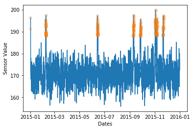
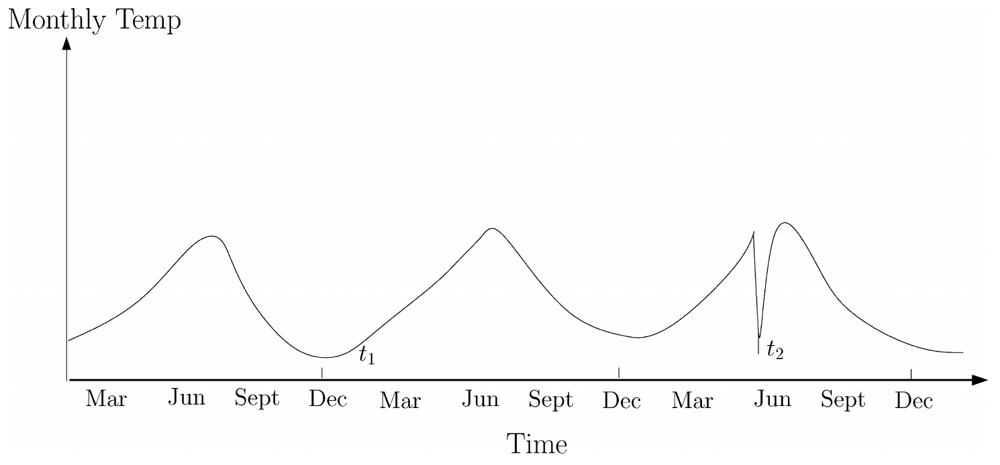
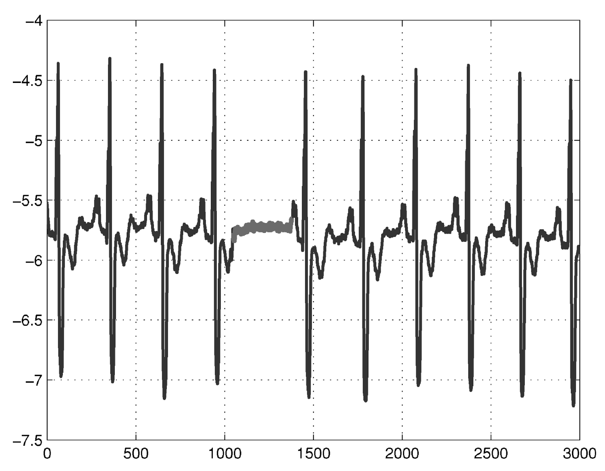

<!-- $theme: default -->
<!-- $size: 16:9 -->
<!-- page_number: true -->

# Anomaly Detection and Predictive Maintenance
###
### Seth Mottaghinejad
Data Scientist
sethmott@microsoft.com
### 
### Wolfgang Pauli
AI Developer
wolfgang.pauli@microsoft.com

--------------------------------------------------------------------------------

## Getting started

- instructor introductions
- user access to environment
- participant backgrounds
- course expectations

--------------------------------------------------------------------------------

## About the course

- this course is hands-on with lots of exercises (solutions will be provided)
- some exercises are intentionally longer and difficult
- programming exercises are in Python on a Jupyter Notebook
- you will be presented with many data science-*ish* challenges
- during exercises you're encouraged to **sit together and work in groups**

--------------------------------------------------------------------------------

## Learning goals

- pre-processing for hot (streaming) data and cold data
- bring together supervised and unsupervised learning to create a predictive model
- automated machine learning vs hand-trained models
- use the Azure SDK to train and deploy models

--------------------------------------------------------------------------------

## Tools covered

- Python (esp. pandas and scikit-learn)
- Jupyter Notebooks
- Open-Source Python port of Twitter anomaly detection API
- Azure Databricks
- HyperDrive (Tuning of Hyperparameters)
- Azure Machine Learning (AML) Python SDK
- Azure Machine Learning SDK for automated ML

--------------------------------------------------------------------------------

## Course Series: Using AI to Detect and Predict Anomalies in Structured and Unstructured Time Series Data

Course 1: Anomaly detection on structured streaming data (*today*)
Course 2: Predictive Maintenance using Automated Machine Learning (*tmrw*)
Course 3: Anomaly detection on unstructured (video) data
Course 4: Deploying Anomaly detection to IoT/Edge devices

---

## Agenda Day 1: Anomaly Detection

- Data exploration
- Data preparation
- Model development
- Model deployment

--------------------------------------------------------------------------------

## What are anomalies?
Any kind of data instance that is not normal.

--------------------------------------------------------------------------------

## Applications of anomaly detection

- intrusion detection
- fraud detection
- medical and public health anomaly detection
- industrial damage detection
- image processing
- anomaly detection in text data
- sensor networks

--------------------------------------------------------------------------------

## Intrusion Detection

### Host-based intrusion detection systems

> Anomalous subsequences (*collective anomalies*) in system call traces, caused by malicious programs, unauthorized behavior and policy violations. 
> The *co-occurrence of events* that is the key factor in differentiating between normal and anomalous behavior.

### Network intrusion detection systems

> Intrusions typically occur as anomalous patterns (*point anomalies*) though certain techniques model the data in a sequential fashion and detect anomalous subsequences (*collective anomalies*).

--------------------------------------------------------------------------------

## Fraud detection

Criminal activities occurring in commercial organizations

- banks (e.g. identity theft)
- credit card companies (e.g. fraudulent credit card applications or usage)
- insurance agencies (e.g. individual and conspiratorial rings of claimants and providers)
- cell phone companies (e.g. tethering)
- stock market (e.g. insider traiding)

--------------------------------------------------------------------------------

## Medical and public health anomaly detection

Anomalies can be due to several reasons: abnormal patient condition, instrumentation errors, or recording errors. 

### Unique Challenges:

> Privacy concerns arise when developing anomaly detection approach.
> Health risks to patients require extreme caution.

--------------------------------------------------------------------------------

## Industrial damage detection

### Fault detection in mechanical units

> Monitor the performance of components such as motors, turbines, oil flow in pipelines, or other mechanical components, and detect defects that might occur due to wear and tear or other unforseen circumstances.

###  Structural defect detection

> Examples: cracks in beams or strains in airframes.

--------------------------------------------------------------------------------

## Other Applications

### Image Data

> Motion detection or abnormal regions in a static image (e.g. mammographic image analysis)

### Text Data

> Example: Detect novel topics, events, or news stories in a collection of documents or news articles.

--------------------------------------------------------------------------------

## Different kinds of anomalies

- Point anomalies
- Contextual anomalies
- Collective anomalies

--------------------------------------------------------------------------------

## Point anomalies

One or more individual data instance can be anomalous with respect to the rest of data.

--------------------------------------------------------------------------------

## Contextual anomalies

A data instance is *anomalous in a specific context*, but not otherwise.

> Example: Having an employee try to log onto her corporate account using her credentials is not anomalous per se. However, when this does not happen within the pre-defined business hours, the instance becomes anomalous in the temporal context.

--------------------------------------------------------------------------------

## Collective anomalies

The individual data instances in a collective anomaly may not be anomalies by themselves.

<!-- 

If a collection of related data instances is anomalous with respect to the entire data set, it is termed a collective anomaly. The individual data instances in a collective anomaly may not be anomalies by themselves, but their occurrence together as a collection is anomalous. Figure 4 is an example that shows a human

-->

--------------------------------------------------------------------------------

## Classes of anomaly detection techniques

-  Supervised anomaly detection
-  Semisupervised anomaly detection
-  Unsupervised anomaly detection

--------------------------------------------------------------------------------

##  Supervised anomaly detection

Assumes the availability of a training data set that has labeled instances for normal as well as anomalous data

### Two major issues:

- Anomalous instances are far fewer compared normal instances (imbalanced classes)
- Obtaining labels accurate and representative of future anomalies

--------------------------------------------------------------------------------

##  Semisupervised anomaly detection

Assumes that the training data has labeled instances *only* for the normal class.

### Typical approach:

>  Build a model to predict normal behavior.  If the predictions of the model fail to predict data instances, mark those instances as anomalies.

--------------------------------------------------------------------------------

##  Unsupervised anomaly detection

Do not require training data, and thus are most widely applicable.

--------------------------------------------------------------------------------

## Final course architecture

--------------------------------------------------------------------------------

## Lab 1.1 (a): Setup and Introduction to Anomaly Detection

A simple, but common approach to anomaly detection:

--------------------------------------------------------------------------------

## Lab 1.1 (a): Setup and Introduction to Anomaly Detection

--------------------------------------------------------------------------------

## Lab 1.1 (a): Setup and Introduction to Anomaly Detection

--------------------------------------------------------------------------------

## Lab 1.1 (a): Setup and Introduction to Anomaly Detection

--------------------------------------------------------------------------------

## Lab 1.1 (a): Setup and Introduction to Anomaly Detection

### Outline of lab:
1. Create a hypothetical time series dataset
2. Apply simple, but common anomaly detection
3. Understand the limitations of this approach in dealing with
    - seasonal trends (e.g. higher energy consumption on the weekends than on weekdays)
    - linear trends (e.g. growth over time)
4. Improve the anomaly detection algorithm to be robust against seasonal and linear trends

--------------------------------------------------------------------------------

## Open and run through lab 1.1 (a): Setup and Introduction

> Start time: 9:40 am
> Expected completion time 20 minutes
> Feel free to work together
> There is a 10-minute break at the end
> Return at 10:10

--------------------------------------------------------------------------------

## Lab 1.1 (b): Data Preparation for Time Series

In this lab, we will explore and visualize our telemetry data.  You will learn how calculate metrics on top of your raw time series to gain deeper insights into your data.  

### In this lab, you will:
- Get to know your dataset better by visualizing it
- Learn how to visualize time series data
- Become familiar with a set of standard metrics that can be defined on time series data

--------------------------------------------------------------------------------

## Lab 1.1 (b): Data Preparation for Time Series

Bollinger Bands

--------------------------------------------------------------------------------

## Lab 1.1 (b): Data Preparation for Time Series

Lag Featuers

--------------------------------------------------------------------------------

## Open and run through lab 1.1 (b): Data preparation for time series

> Start time: 10 am
> Expected completion time 30 minutes
> Feel free to work together
> There is a 10-minute break at the end
> Return at 10:40

--------------------------------------------------------------------------------

## Lab 1.2: Model Development

### In this lab, we will do the following:
- Use python port [pyculiarity](https://github.com/nicolasmiller/pyculiarity) of [Twitter's anomaly detection R library](https://github.com/twitter/AnomalyDetection)
- Apply this library to detect anomalies in our telemetry data
- Optimize our approach to perform online anomaly detection

--------------------------------------------------------------------------------

## Lab 1.2: Model Development

We will first develop a solution that processes all the data in *batch*, and then optimize the solution so that it detects anomalies *online*, as a new sensor measurement arrives.

### Challenges:
1. How to calculate metrics online?
2. How many historic sensor readings do we need to consider to get robust anomaly detection?
 

--------------------------------------------------------------------------------

## Open and run through lab 1.2: Model development

> Start time: 10:40 am
> Expected completion time 1:20 minutes
> Feel free to work together
> There is a 1-hour lunch break at the end
> Return at 1 pm

--------------------------------------------------------------------------------

## Lab 1.3: Model Deployment

This is the last session of today. 

We will cover the following steps:

1. Recap: Configure your Azure Workspace.
2. Create a Docker image, using the Azure ML SDK.
3. Test your Application by running the Docker container locally.
6. Register your docker image in the Azure Container Registry (ACR).
7. Deploy your Docker image as an Azure Container Instance ([ACI](https://azure.microsoft.com/en-us/services/container-instances/)) Webservice.
8. Test your Webservice.
 
--------------------------------------------------------------------------------

## Open and run through lab 1.3: Deployment

> Start time: 1 pm
> Expected completion time 60 minutes
> Feel free to work together
> There is a 10-minute break at the end

--------------------------------------------------------------------------------

## Q&A

--------------------------------------------------------------------------------

## End of day 1

### Further reading:

> *Anomaly Detection: A Survey* by Varun Chandola, Arindam Banerjee, and Vipin Kumar

--------------------------------------------------------------------------------

## Agenda Day 2: Predictive Maintenance

- Data exploration
- Training a model manually
- Training a model using automated ML
- Model deployment

--------------------------------------------------------------------------------

## The case for combining anomaly detection and predictive mainentance

Example use-case: *Anomalous* sensor measurements on industrial machines may be *predictive* of future catastrophic failure.  

## Solution:
> 1. Anomaly Detection - Detect anomalies in timeseries data
> 2. Predictive Maintenance - Predict future failures and schedule maintenance

--------------------------------------------------------------------------------

## Corrective maintenance (aka planned maintenance):

> Based on the assumption that a machine component will degrade within a given period of time that is common for its type.  Maintenance is scheduled based on average or expected life statistics.

--------------------------------------------------------------------------------

## Predictive maintenance (aka preventive maintenance):

> By trying to predict failures before they happen and run just in time maintenance. This approach is often more optimal in balancing the cost failures and the labor and opportunity cost of equipment maintenance.

--------------------------------------------------------------------------------

## Common PdM use-cases

- **Airline:** Flight delay and cancellations due to mechanical problems
- **Banking:** ATM failure due to paper jam
- **Energy:** Wind turbine or circuit breat failures
- **Transportation:** Elevator door failures or train wheel failures

--------------------------------------------------------------------------------

## PdM data requirements

- static features (such as machine metadata)
- temporal or time-varying features (such as machine telemetries)
- error logs (anomalies or non-breaking events)
- maintenance or repair logs (breaking events requiring part replacement)
- operational history of the equipment including failures (labels)

--------------------------------------------------------------------------------

## PdM temporal data requirements

- data is collected at more or less regular time units
- time units are defined based on business justification
- time units don't have to be the same as the frequency of data collection
  - low frequency can mean there's not enough granurality in the data
  - high frequency means differences are smaller between adjacent time units

--------------------------------------------------------------------------------

## Considerations for training PdM models

- Choose between time-dependent split vs. splitting by machines/devices
- Carefully consider the important hyper-parameters and tune them
- Carefully consider model performance metrics based on misclassification cost
- Carefully consider various feature engineering approaches and the difficulty of implementing them at score time

--------------------------------------------------------------------------------

## Evaluating a PdM model

### Precision
> Precision of PdM models relate to the rate of false alarms. Lower precision of the model generally corresponds to a higher rate of false alarms.
### Recall
>Recall rate denotes how many of the failures were correctly identified by the model. Higher recall rates mean the model is successful in identifying the true failures.
### F1 score
> F1 score is the harmonic average of precision and recall, with its value ranging between 0 (worst) to 1 (best). You can compute the F1 score based on the weights of your choosing.

--------------------------------------------------------------------------------

## PdM scoring

- To conform to the model signature, the features in the new data must be engineered in the same manner as the training data.
- Scenarios involving anomaly detection typically implement **online scoring** (aka **real-time scoring**). 
- PdM usually involves batch scoring, but can be implemented in *near* real-time.

--------------------------------------------------------------------------------

## Open and run through lab 2.1

> Start time: 9:40
> Expected completion time 50 minutes
> Feel free to work together
> There is a 15-minute break at the end
> Return at 10:45

--------------------------------------------------------------------------------

## automated machine learning

- Searching for the right machine learning model can be very time-consuming
- You need to choose an algorithm and then choose the right hyper-parameters for it
- Automated ML does all that against a pre-defined compute target
- We need to be careful in our choice of the metric we optimize over
- Models selection should also be based on their expected performance in production
- Here's a list of [algorithms](https://docs.microsoft.com/en-us/azure/machine-learning/service/how-to-configure-auto-train#select-your-experiment-type) that can be used for training
- You can configure your [compute target](https://docs.microsoft.com/en-us/azure/machine-learning/service/how-to-set-up-training-targets)

--------------------------------------------------------------------------------

## Open and run through lab 2.2

> Expected completion time 40 minutes
> Feel free to work together
> There is a 20-minute break at the end

--------------------------------------------------------------------------------

## Operationalization options

- We can deploy models as REST API end-points for online or batch scoring
- Deployment to [ACI](https://docs.microsoft.com/en-us/azure/machine-learning/service/how-to-deploy-to-aci) is quick and great for testing
- We specify the number of CPUs (1 by default) and gigabyte of RAM (1 by default) needed for your ACI container
- Deployment to [AKS](https://docs.microsoft.com/en-us/azure/machine-learning/service/how-to-deploy-to-aks) can be used for high-scale production scenarios
- Other deployment scenarios are available (see [here](https://docs.microsoft.com/en-us/azure/machine-learning/service/how-to-deploy-and-where))

--------------------------------------------------------------------------------

## Operationalization steps

- Register the model or retrieve a pre-registered model
  > The can be loaded from pickle file if not in current session or registered directly from the pickle file.
- Configure and create an image: provide execution script, Conda dependencies file, Python runtime
  - The execution script has an `init()` function for loading model and a `run()` function for getting predictions from data
  - Conda dependencies can be specified in a YAML config file
- Configure an ACI container: provide number of CPUs and RAM
- Deploy service into ACI container from image

--------------------------------------------------------------------------------

## Open and run through lab 2.3

> Expected completion time 45 minutes
> Feel free to work together
> There is a 15-minute break at the end

--------------------------------------------------------------------------------

## Debugging a live deployment

- We don't want to launch a new web service every time we change its base image
- We test our application by running the Docker container locally and making necessary updates
- We commit the changes in your Docker container to the Docker image and update the Azure Container Registry (ACR)
- Deploy your Docker image as an Azure Container Instance ([ACI](https://azure.microsoft.com/en-us/services/container-instances/)) Webservice

--------------------------------------------------------------------------------

## Open and run through lab 2.4

> Expected completion time 45 minutes
> Feel free to work together
> There is a 15-minute break at the end

--------------------------------------------------------------------------------

## Q&A

--------------------------------------------------------------------------------

## End of day 2

### Further reading

> [The predictive maintenance playbook](https://docs.microsoft.com/en-us/azure/machine-learning/team-data-science-process/cortana-analytics-playbook-predictive-maintenance)

--------------------------------------------------------------------------------

# the End

--------------------------------------------------------------------------------

--------------------------------------------------------------------------------

[microsoft-logo]: ./images/microsoft-logo-white.jpg

<!-- 

Notes about these slides.

 -->
